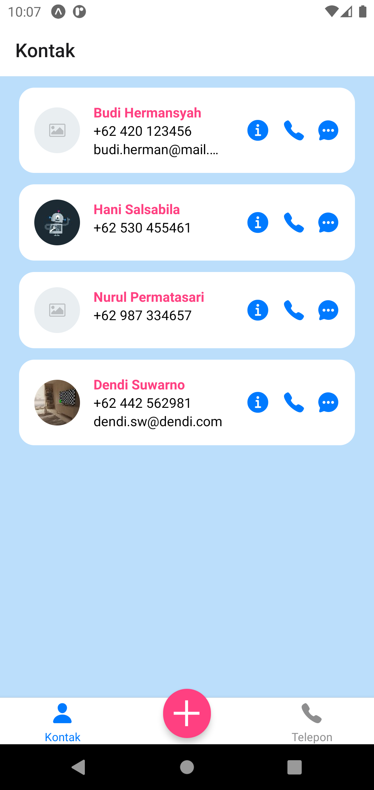
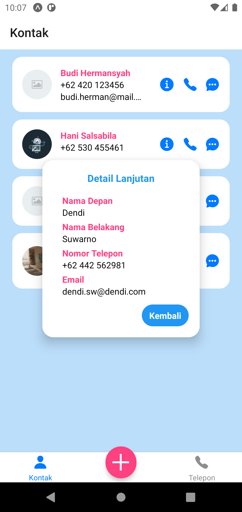

# Tugas 4
Repo ini berisi source code untuk aplikasi tugas ke 4, yaitu tentang studi kasus aplikasi pengelola kontak menggunakan API Expo.
Terdapat beberapa library yang digunakan seperti `react-navigation`, `expo-contacts`, `expo-image-picker`, `@expo/vector-icons`, dan lain-lain.

## Identitas Diri
|||
|-|-|
|Nama|Andhika Wibawa|
|NIM|119140218|
|Kelas|PAM RA|

## Tata Cara Build APK ([unduh](docs/RA-Andhika%20Wibawa-119140218-Tugas%20Individu%204.apk))
1. Pastikan Expo dan React (Native) telah terpasang pada perangkat
2. Gunakan `npm install` untuk memasang semua dependensi aplikasi yang dibutuhkan
2. Gunakan `expo start --android` untuk menjalankan aplikasi di emulator Expo Android (Tekan `Ctrl + C` untuk berhenti)
3. Gunakan `expo build:android -t apk` atau `eas build --platform android --profile preview` untuk meng-compile aplikasi
4. Unduh file (APK) melalui link atau QR code yang dihasilkan pada proses sebelumnya

## Penjelasan Singkat
Aplikasi terdiri dari 3 screen (tab) utama, yaitu:
1. **Kontak:** Digunakan untuk melihat daftar kontak yang telah tersimpan. Jika ingin melihat detail lebih lengkap dari suatu kontak, dapat menekan logo informasi (i). Untuk melihat kontak, digunakan 2 buah fungsi utama yaitu `Contacts.requestPermissionsAsync` dan `Contacts.getContactsAsync`.
2. **Tambah Kontak:** Digunakan untuk menambah dan menyimpan kontak baru, serta memilih gambar dari kontak yang akan ditambah. Untuk menambah kontak ini, digunakan 2 buah fungsi utama yaitu `Contacts.addContactAsync` dan `ImagePicker.launchImageLibraryAsync`.
3. **Telepon:** Digunakan untuk mengetik nomor telepon untuk kemudian dapat dipanggil, dikirim pesan, ataupun ditambahkan ke kontak. Untuk saat ini, fungsi telepon dan pesan hanya berupa _placeholder_. Tidak digunakan API Expo pada tab ini, namun digunakan fungsi navigasi ketika menambah nomor ke kontak.

## Kekurangan (WIP)
- Sementara ini kontak yang sudah ditambah tidak bisa dihapus (untuk mencegah terhapusnya kontak secara tidak sengaja saat pengetesan). Gunakan aplikasi lain untuk menghapus kontak
- Permission aplikasi mungkin perlu diizinkan secara manual oleh pengguna (hanya apabila terjadi error/ketidaksesuaian fungsi)
- Tema aplikasi sedikit kurang konsisten (terutama dari segi warna)

## Tampilan Aplikasi
<table>
    <tr>
        <td>Tampilan telepon (saat kosong)</td>
        <td>Tampilan telepon (saat diisi)</td>
    </tr>
    <tr>
        <td></td>
        <td></td>
    </tr>
    <tr>
        <td>Tampilan tambah kontak (isi teks)</td>
        <td>Tampilan tambah kontak (ambil gambar)</td>
    </tr>
    <tr>
        <td></td>
        <td></td>
    </tr>
        <tr>
        <td>Tampilan tambah kontak (dengan gambar)</td>
        <td>Tampilan daftar kontak (setelah ditambah)</td>
    </tr>
    <tr>
        <td></td>
        <td></td>
    </tr>
        <tr>
        <td>Tampilan daftar kontak (saat diklik)</td>
        <td>Tampilan daftar kontak (saat diklik)</td>
    </tr>
    <tr>
        <td></td>
        <td></td>
    </tr>
</table>
