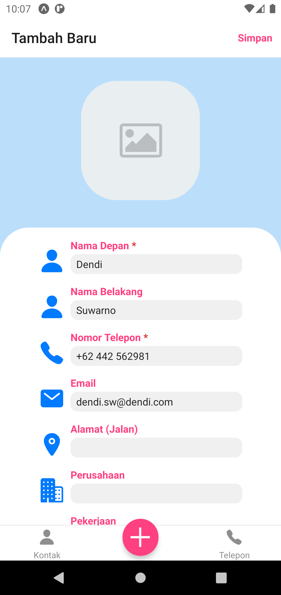

# Tugas 2
Repo ini berisi source code untuk aplikasi tugas ke 2, yaitu tentang studi kasus jadwal penerbangan pesawat.
Terdapat beberapa library yang digunakan seperti `react-navigation`, `react-native-picker`, `react-native-svg`, dan lain-lain.

## Identitas Diri
|||
|-|-|
|Nama|Andhika Wibawa|
|NIM|119140218|
|Kelas|PAM RA|

## Penjelasan Singkat
1. Pastikan Expo dan React (Native) telah terpasang pada perangkat
2. Gunakan `npm install` untuk memasang semua dependensi aplikasi yang dibutuhkan
2. Gunakan `expo start --android` untuk menjalankan aplikasi di emulator Expo Android (Tekan `Ctrl + C` untuk berhenti)
3. Gunakan `expo build:android -t apk` atau `eas build --platform android --profile preview` untuk meng-compile aplikasi
4. Unduh file (APK) melalui link atau QR code yang dihasilkan pada proses sebelumnya

## Keterangan Tambahan
- Saya melakukan penyesuaian pada file JSON dan text input dikarenakan keterbatasan untuk menggenerasikan data random pada file JSON dengan kriteria yang saling berkaitan
- Sebagian besar kode dan aset penting diletakkan pada folder `assets`
- Konfigurasi file `App.js`, `app.json`, `eas.json`, dan `metro.config.js` telah diubah dan disesuaikan dengan kebutuhan proyek

## Tampilan Aplikasi
<table>
    <tr>
        <td>Tampilan awal aplikasi</td>
        <td>Tampilan picker saat diklik</td>
    </tr>
    <tr>
        <td></td>
        <td></td>
    </tr>
    <tr>
        <td>Tampilan hasil pencarian saat di-scroll</td>
        <td>Tampilan hasil pencarian saat diam</td>
    </tr>
    <tr>
        <td></td>
        <td></td>
    </tr>
</table>
