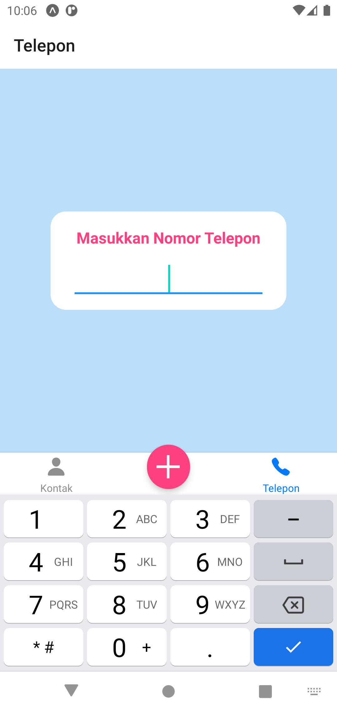
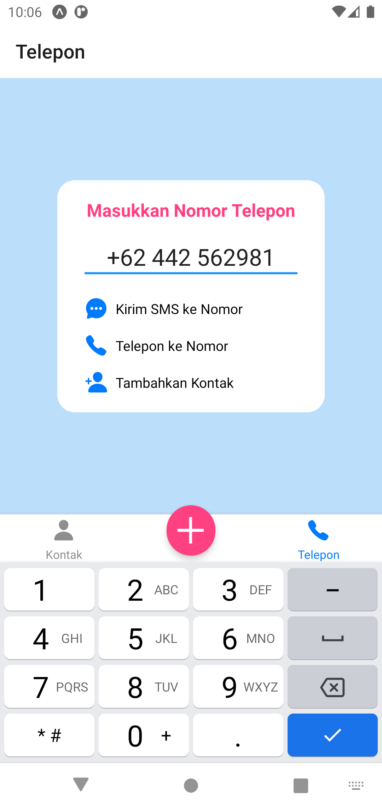
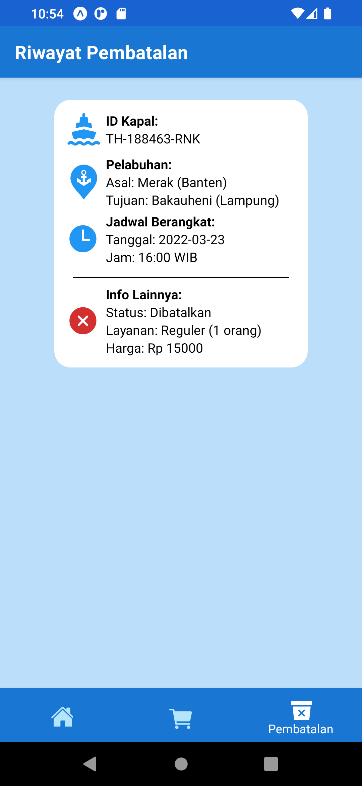

# Ujian Tengah Semester
Repo ini berisi source code untuk aplikasi UTS, yaitu tentang studi kasus pemesanan tiket kapal.
Fungs-fungsi dalam aplikasi ini antara lain nested navigator (Tab dan Stack), pengisian form (pembelian tiket), pengolahan JSON (pesanan dan pembatalan tiket), penggunaan Route, State, Context, dll.
Terdapat beberapa library yang digunakan seperti `react-navigation`, `react-native-picker`, `react-native-svg`, `@expo/vector-icons`, dan `@react-native-community/datetimepicker`.

## Identitas Diri
|||
|-|-|
|Nama|Andhika Wibawa|
|NIM|119140218|
|Kelas|PAM RA|

## Tata Cara Build APK ([unduh](docs/Aplikasi.apk))
1. Pastikan Expo dan React (Native) telah terpasang pada perangkat
2. Gunakan `npm install` untuk memasang semua dependensi aplikasi yang dibutuhkan
2. Gunakan `expo start --android` untuk menjalankan aplikasi di emulator Expo Android (Tekan `Ctrl + C` untuk berhenti)
3. Gunakan `expo build:android -t apk` atau `eas build --platform android --profile preview` untuk meng-compile aplikasi
4. Unduh file (APK) melalui link atau QR code yang dihasilkan pada proses sebelumnya

## Penjelasan Singkat
Aplikasi terdiri dari 3 screen (tab) utama, yaitu:
1. **Beranda:** Digunakan untuk memesan tiket, memilih jadwal, dan melakukan pembayaran tiket. Terdapat 3 (nested) stack bantuan untuk mencapai ketiga fungsi tersebut. Elemen yang digunakan antara lain `Picker`, `TextInput`, `Icon/SVG`, `TouchableOpacity`, dan `FlatList`. Parameter hasil pembelian tiket akan di-passing ke tab selanjutnya yaitu tab Pesanan.
2. **Pesanan:** Digunakan untuk melihat riwayat tiket yang telah dipesan (menggunakan FlatList). Data riwayat ini disimpan ke dalam `Context` array agar bersifat konsisten dengan tab Pembatalan. Untuk membedakan antara tiket yang dipesan dan dibatalkan, digunakan `key` berupa "Dipesan" dan "Dibatalkan" yang akan dicek pada saat rendering FlatList. Bila elemen hasil FlatList diklik, pengguna dapat membatalkan pesanan tiket.
3. **Pembatalan:** Digunakan untuk melihat riwayat tiket yang telah dibatalkan (saling berbagi `Context` dengan tab Pesanan). Riwayat ini ditampilkan menggunakan FlatList, dimana jika salah satu elemen FlatList diklik, pengguna dapat melihat detail lain seperti identitas pemesan tiket.

## Keterangan Tambahan
- Saya menghilangkan bottom tab ke-4 karena bersifat duplikat dengan fungsi tab lainnya dan karena tidak termasuk kriteria penilaian
- Sebagian besar kode dan aset penting yang dibutuhkan aplikasi diletakkan pada folder `assets`
- Konfigurasi file `App.js`, `app.json`, `eas.json`, dan `metro.config.js` telah diubah dan disesuaikan dengan kebutuhan proyek

## Demo Video

## Tampilan Aplikasi
<table>
    <tr>
        <td>Tampilan form tiket awal</td>
        <td>Tampilan kalendar saat memilih tanggal</td>
    </tr>
    <tr>
        <td></td>
        <td></td>
    </tr>
    <tr>
        <td>Tampilan hasil pencarian jadwal</td>
        <td>Tampilan jadwal saat diklik</td>
    </tr>
    <tr>
        <td></td>
        <td></td>
    </tr>
        <tr>
        <td>Tampilan form pembayaran tiket</td>
        <td>Tampilan konfirmasi pembayaran</td>
    </tr>
    <tr>
        <td></td>
        <td></td>
    </tr>
        <tr>
        <td>Tampilan riwayat pesanan tiket</td>
        <td>Tampilan riwayat tiket saat diklik</td>
    </tr>
    <tr>
        <td></td>
        <td></td>
    </tr>
        </tr>
        <tr>
        <td>Tampilan riwayat pembatalan tiket</td>
        <td>Tampilan isi riwayat pembatalan tiket</td>
    </tr>
    <tr>
        <td></td>
        <td></td>
    </tr>
</table>
